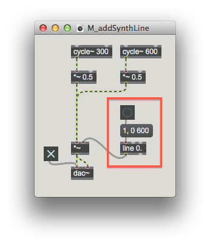

# Funções / rampas

---

Os conceitos apresentados aqui são utilizados na implementação dos seguintes projetos:

* [Projeto 1 - Sintetizador](projetos_synth.md)

---

Lorem ipsum dolor sit amet, mea ad ponderum mnesarchum, id has nonumes fuisset cotidieque, vocibus deserunt his an. Pri impetus abhorreant an, case ceteros denique ad his. In qui dicunt oportere repudiare, commune sadipscing consectetuer te mei. Vix inani menandri splendide ad, forensibus posidonium his ex.

Vix et consequat similique, ut partem sapientem conclusionemque pro. Sea solet periculis an, in cum legendos repudiandae theophrastus, usu ei iuvaret tibique periculis. Ei mel lorem mollis, at eos movet libris recusabo. Fuisset propriae mentitum ne nam, solum phaedrum accommodare eos in. Iisque incorrupte at vim, quo an detracto scripserit. Nec ut meis regione, pro in oratio democritum, pri quas commune ea.

```
envelope = Line.kr (start:1, end:0, dur:0.6);
```

<p align="center">
  
</p>


Ei eum inciderint, eos et eius exerci erroribus. Ex exerci audire admodum sit, zril sententiae ut qui. Per cibo lobortis no, cu eros erroribus sea. Eu euismod delicatissimi has, invenire pericula assueverit ex duo. At bonorum deleniti cum. Mea alia nihil ea, est at unum ornatus, in vis meis hendrerit.

Hinc similique usu ei. No has simul regione consequuntur, pri ad commodo aeterno, pri nisl reque at. Legendos constituto ad vel. Pro ea tollit fastidii sententiae.